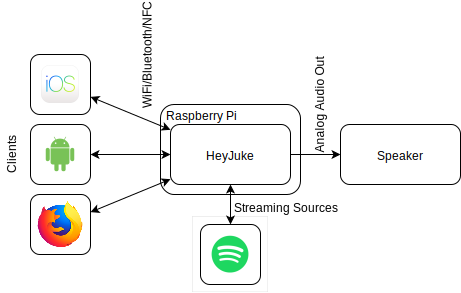
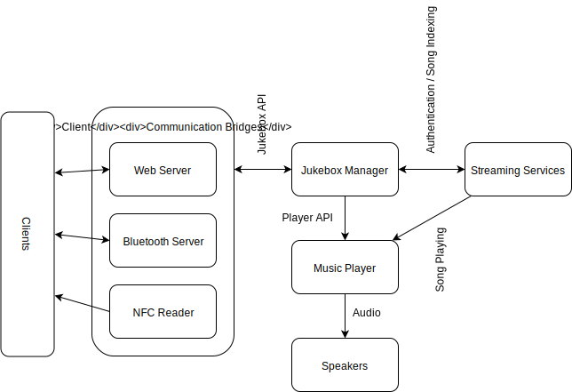
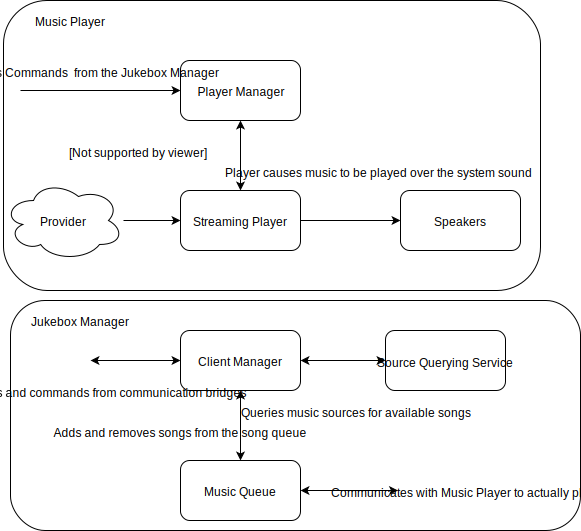

# Diagrams

This folder contains various diagrams used to describe the HeyJuke system.

+ [D0](./D0.svg) - Describes the system at a high level
+ [D1](./D1.svg) - Describes the system in terms of subsystems
+ [D2](./D2.svg) - Describes the system at complete detail within the
  subsystems

# D0

# D1

# D2

